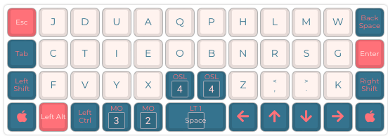
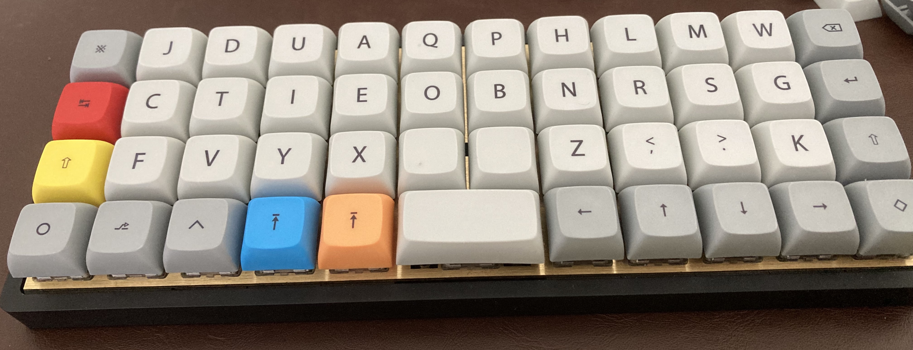
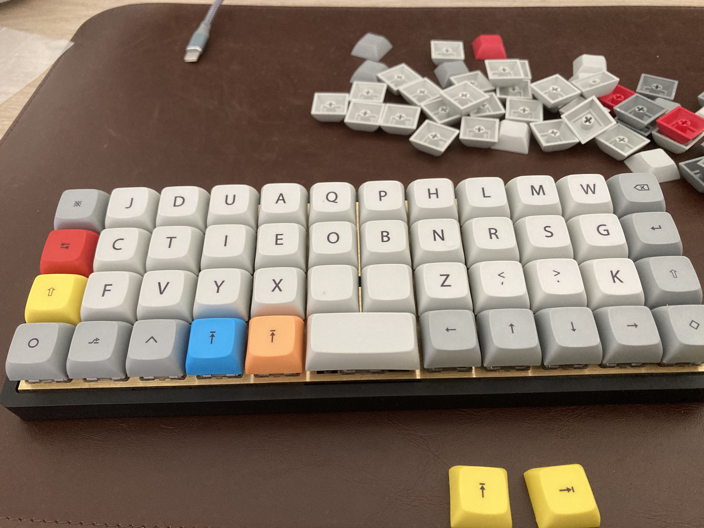
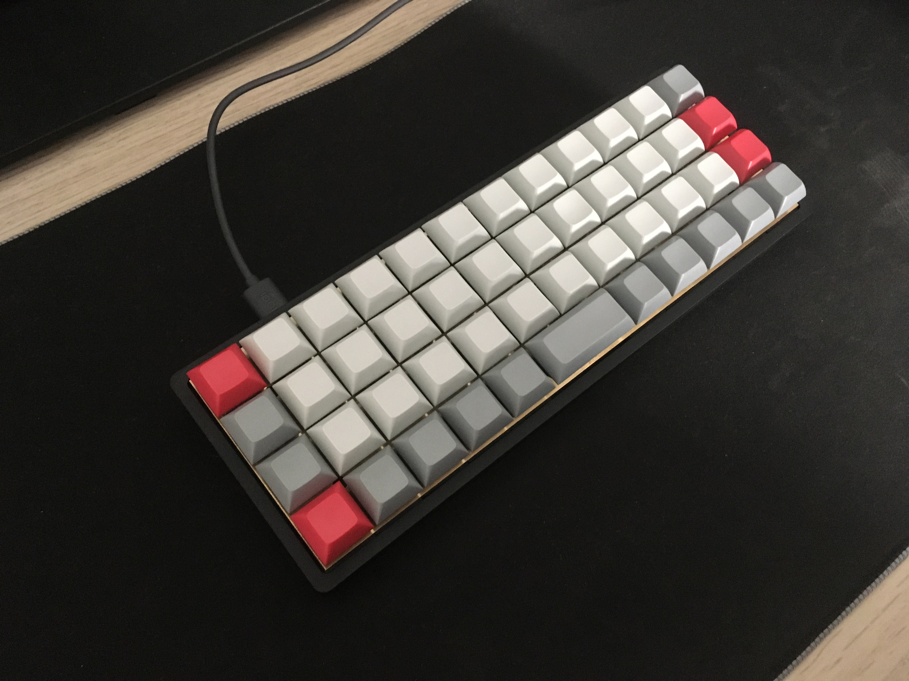
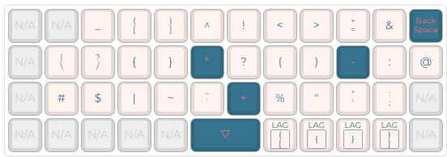
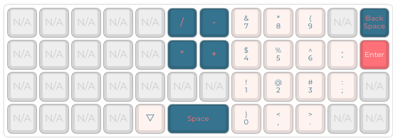
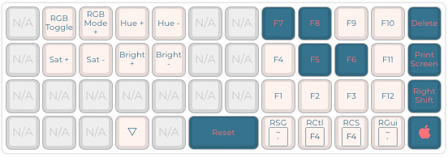
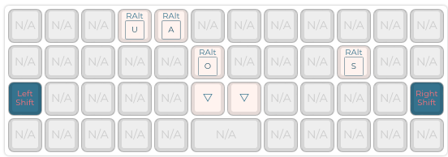

# QMK Firmware bm40hsrgb v2 Neo Bone

    
    

Forked from QMK firmware and modified to enable my BM40HSRGB v2 keyboard work with my custom [Neo Bone layout](https://www.neo-layout.org/Layouts/bone/). Utilizes multiple layers and Taps_Word (Caps_Word).

## Table Of Content

- [Getting Started](#getting-started)
  - [Dependencies](#dependencies)
  - [Installation](#installation)
  - [Compile and run](#compile-and-run)
- [Vizualise Keymap](#vizualise-keymap)
- [Example pictures](#example-pictures)
- [See also](#see-also)
- [Original readme of forked repo](#quantum-mechanical-keyboard-firmware)

## Getting Started

### Dependencies

In order for the scripts to work you will need the following dependencies:
 * C compiler
 * qmk (& qmk setup)
 * make

### Installation
 - For maximum compatibility ensure that your PC is set to use the English International keyboard layout.
 - `git clone https://github.com/thob97/qmk_firmware_bm40hsrgb_v2_Neo_Bone.git`
 - `cd qmk_firmware_bm40hsrgb_v2_Neo_Bone`

### Compile and run
 - `make git-submodule`
 - `make kprepublic/bm40hsrgb/rev2:default:flash`
 - `echo 'PATH="$HOME/.local/bin:$PATH"' >> $HOME/.bashrc && source $HOME/.bashrc`

## Vizualise Keymap:
The PDF file, which provides a visualized representation of the keymap, was generated using: https://config.qmk.fm/#/kprepublic/bm40hsrgb/LAYOUT_planck_mit.
Please note that this visualization is for illustrative purposes only. Some keys may differ from the JSON file or the website because certain functionalities cannot be accurately represented (e.g., I have implemented a feature that protects against accidental pressing of the reset key. The key must be pressed 10 times for its functionality. This cannot be visualized on the website).

## Example pictures

    
    

    
    
    
    
    

## See also
You may also be interested in the following projects:
* [3D printed beamer](https://github.com/thob97/3d_printed_beamer.git)
* [Custom 10 inch server rack](https://github.com/thob97/custom_10_inch_server_rack.git)
* [3040 CNC marlin](https://github.com/thob97/3040-CNC-marlin.git)

 
 
 
 
 
 
 
 
 
 

# Quantum Mechanical Keyboard Firmware

This is a keyboard firmware based on the [tmk\_keyboard firmware](https://github.com/tmk/tmk_keyboard) with some useful features for Atmel AVR and ARM controllers, and more specifically, the [OLKB product line](https://olkb.com), the [ErgoDox EZ](https://ergodox-ez.com) keyboard, and the [Clueboard product line](https://clueboard.co).

## Documentation

* [See the official documentation on docs.qmk.fm](https://docs.qmk.fm)

The docs are powered by [Docsify](https://docsify.js.org/) and hosted on [GitHub](/docs/). They are also viewable offline; see [Previewing the Documentation](https://docs.qmk.fm/#/contributing?id=previewing-the-documentation) for more details.

You can request changes by making a fork and opening a [pull request](https://github.com/qmk/qmk_firmware/pulls), or by clicking the "Edit this page" link at the bottom of any page.

## Supported Keyboards

* [Planck](/keyboards/planck/)
* [Preonic](/keyboards/preonic/)
* [ErgoDox EZ](/keyboards/ergodox_ez/)
* [Clueboard](/keyboards/clueboard/)
* [Cluepad](/keyboards/clueboard/17/)
* [Atreus](/keyboards/atreus/)

The project also includes community support for [lots of other keyboards](/keyboards/).

## Maintainers

QMK is developed and maintained by Jack Humbert of OLKB with contributions from the community, and of course, [Hasu](https://github.com/tmk). The OLKB product firmwares are maintained by [Jack Humbert](https://github.com/jackhumbert), the Ergodox EZ by [ZSA Technology Labs](https://github.com/zsa), the Clueboard by [Zach White](https://github.com/skullydazed), and the Atreus by [Phil Hagelberg](https://github.com/technomancy).

## Official Website

[qmk.fm](https://qmk.fm) is the official website of QMK, where you can find links to this page, the documentation, and the keyboards supported by QMK.
